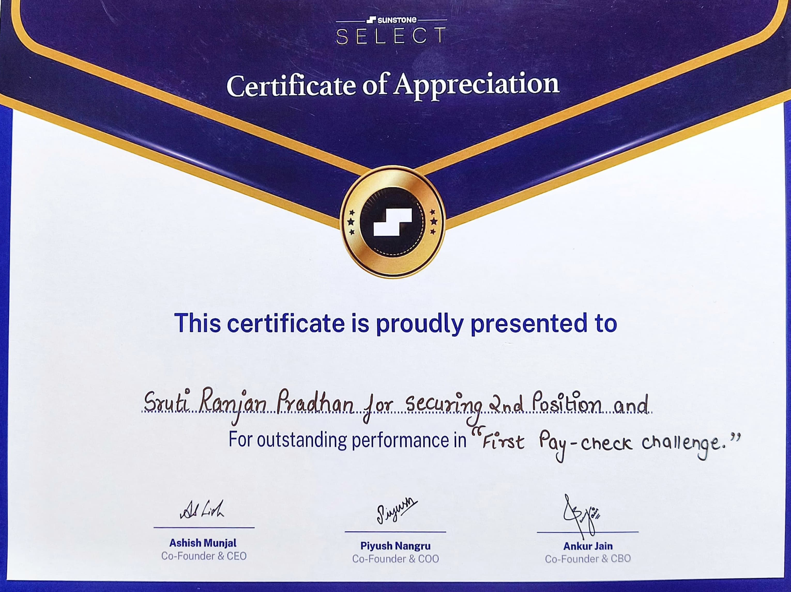

# 🥗 Fresh Fuel - Gym Supplement E-commerce

**Fresh Fuel** is a Shopify-based e-commerce platform focused on selling healthy gym supplements.

---

## 🏆 Achievements

- 🥈 Secured **2nd position** in the **1st Paycheck Challenge**
- 💰 Won a **₹3,000 cash prize**
- 🧾 Certificate awarded *(see below)*
- 📚 Built in **2nd semester** as part of the **Sunstone curriculum challenge project**

---

## 🔍 Project Overview

- Built using **Shopify** to simulate a professional e-commerce platform.
- Designed to serve **gym-goers and fitness enthusiasts** looking for high-quality nutritional supplements.
- Includes a clean UI, product categorization, cart management, and payment integration via Shopify.

---

## 🧠 My Contributions

- Designed **wireframes and mockups**
- Drafted the **Software Requirement Specification (SRS)**
- Handled overall **branding and store setup** using Shopify
- Managed **product listings**, descriptions, and UI customizations

---

## 📄 Design & Documentation

| Wireframes & Mockups |
|----------------------|
| [View PDF](assets/wireframe-mockups/Wireframes%20%26%20Mockups.pdf) |

---

## 🧾 Certificate

---

## 🛠️ Tools Used

- **Shopify** – Platform for e-commerce development
- **Figma** – For mockups and wireframes
- **Google Docs** – For SRS documentation

---

## 📌 Status

- ⛔ The live website is no longer active due to Shopify subscription expiry.
- ✅ All documentation, screenshots, and design materials are preserved in this repo.

---

